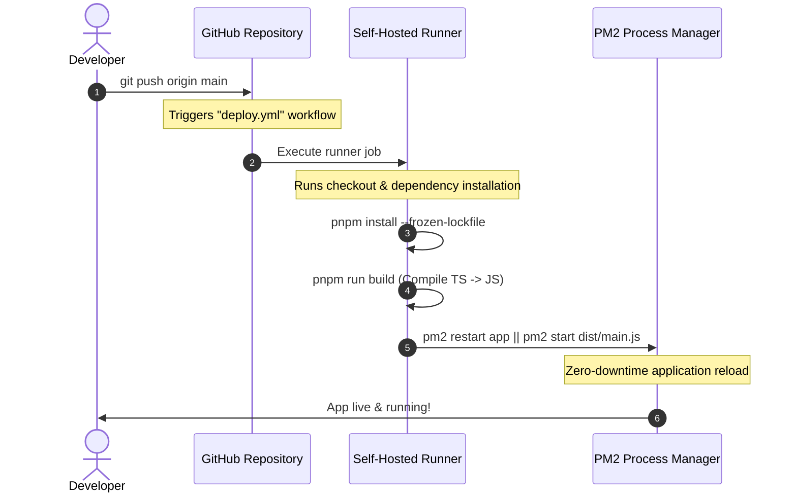

# GitHub Actions & PM2 Deploy Template (TypeScript + Node.js)

A production-ready template for continuous deployment of TypeScript-based Node.js applications using a self-hosted GitHub Actions runner and **PM2** process manager.

This repository serves as a boilerplate for projects that require instant, lightweight CI/CD directly to your own self-hosted server or Virtual Private Server (VPS), avoiding expensive third-party container hosting while maintaining zero-downtime restarts.

---

## 🛠️ Tech Stack

- **Runtime**: [Node.js](https://nodejs.org/) (v20+)
- **Language**: [TypeScript](https://www.typescriptlang.org/) (Strict mode, ES2022 compile target)
- **Package Manager**: [pnpm](https://pnpm.io/) (Fast, disk-efficient package management with lockfile freezing)
- **Process Manager**: [PM2](https://pm2.keymetrics.io/) (Graceful shutdowns, daemonized process management, and log rotation)
- **CI/CD Platform**: [GitHub Actions](https://github.com/features/actions) using a **Self-Hosted Runner**

---

## 🔄 How It Works

The workflow automates your continuous integration and deployment flow:



1. **Trigger**: When you push code to the `main` branch, the deployment workflow defined in `.github/workflows/deploy.yml` is triggered.
2. **Checkout & Cache**: The self-hosted runner checks out the repository.
3. **Dependency Installation**: Using `pnpm install --frozen-lockfile`, dependencies are installed quickly and predictably.
4. **Compilation**: TypeScript code inside `src/` compiles to Javascript output in the `dist/` directory using the TypeScript Compiler (`tsc`).
5. **Deployment & Restart**: The runner sends a reload command to PM2. It gracefully restarts the existing process (or launches it if it's the first time), picking up any environment changes instantly.

---

## 🚀 Setup & Installation Guide

Follow these steps to deploy this template to your own server.

### 1. Server Prerequisites

Ensure the following tools are installed globally on your self-hosted server:

```bash
# Install nvm (Node Version Manager)
curl -o- https://raw.githubusercontent.com/nvm-sh/nvm/v0.39.7/install.sh | bash
source ~/.bashrc

# Install Node.js v20
nvm install 20

# Install pnpm using Corepack
corepack enable
corepack prepare pnpm@latest --activate

# Install PM2
npm install -g pm2
```

### 2. Configure the Self-Hosted GitHub Runner

1. In your GitHub repository, go to **Settings** > **Actions** > **Runners** > **New self-hosted runner**.
2. Select your OS (e.g., Linux, macOS, or Windows) and architecture.
3. Execute the download and configuration commands on your target server.
4. Configure the runner to run as a background service:
   ```bash
   # Run these commands inside the runner folder on your server
   sudo ./svc.sh install
   sudo ./svc.sh start
   ```

### 3. Initialize the Application (First Time Setup)

Before running the GitHub action, it is highly recommended to run the initial installation and PM2 startup manually on your server to avoid permission errors or initial process configuration gaps:

```bash
# Clone the repository (if not already fetched by the runner)
git clone <your-repo-url>
cd <your-repo-dir>

# Install dependencies and build
pnpm install
pnpm run build

# Start the application with PM2 for the first time
pm2 start dist/main.js --name "node-pm2-deploy-app"
```

### 4. Adjust the GitHub Action Workflow

Open [deploy.yml](file:///.github/workflows/deploy.yml) and verify the following environment variable:

```yaml
export PM2_HOME=/home/root/.pm2
```
*Make sure `PM2_HOME` points to the home directory of the user running the PM2 daemon on your server. If the GitHub Actions runner runs under the same user, you can omit or comment out this line.*

---

## 💻 Development Commands

- `pnpm install` — Install local dependencies.
- `pnpm run build` — Build TypeScript to static Javascript files inside the `dist` directory.
- `pnpm start` — Run the compiled Javascript server locally.

---

## 🛡️ License

This project is open-source and available under the [MIT License](file:///LICENSE).
